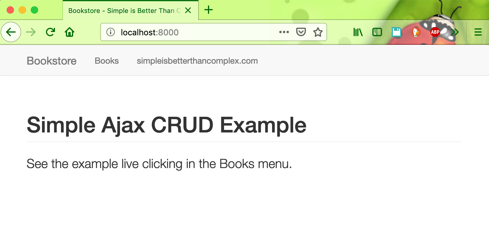
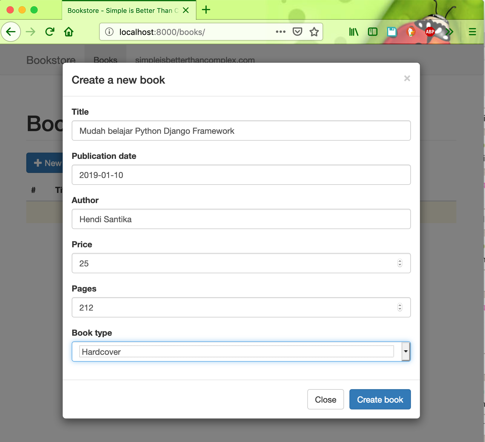
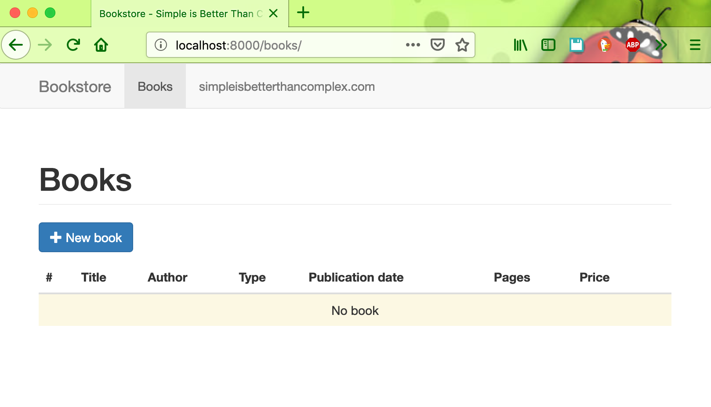
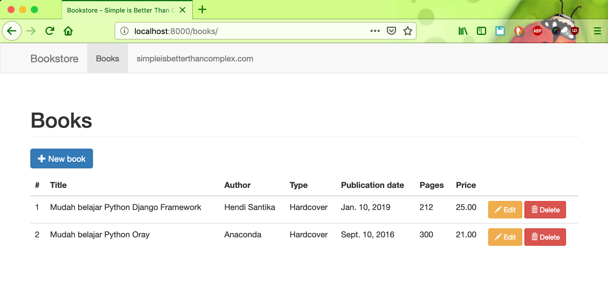
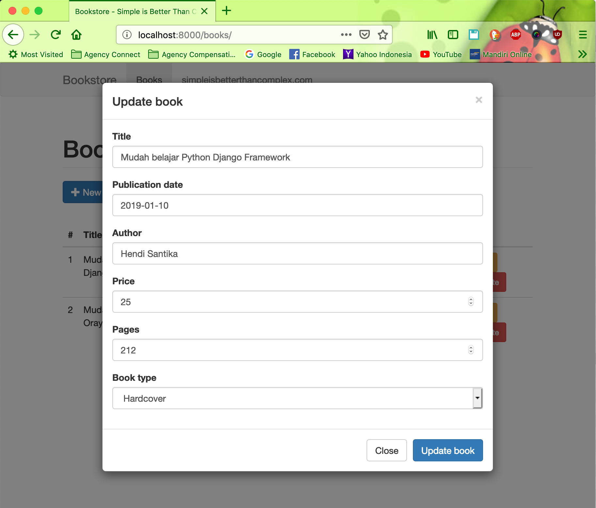
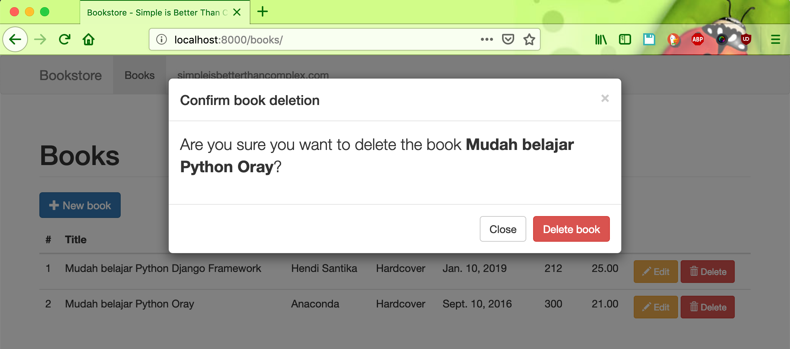

# django-simple-ajax-crud

#### Running Locally

```
git clone https://github.com/hendisantika/django-simple-ajax-crud.git
```

```bash
pip install -r requirements.txt
```
```bash
python manage.py migrate
```

```bash
python manage.py runserver
```

#### Screen shot


##### Home Page



##### Add New Book



##### List All Books





##### Edit Data Book



##### Delete Data Book



